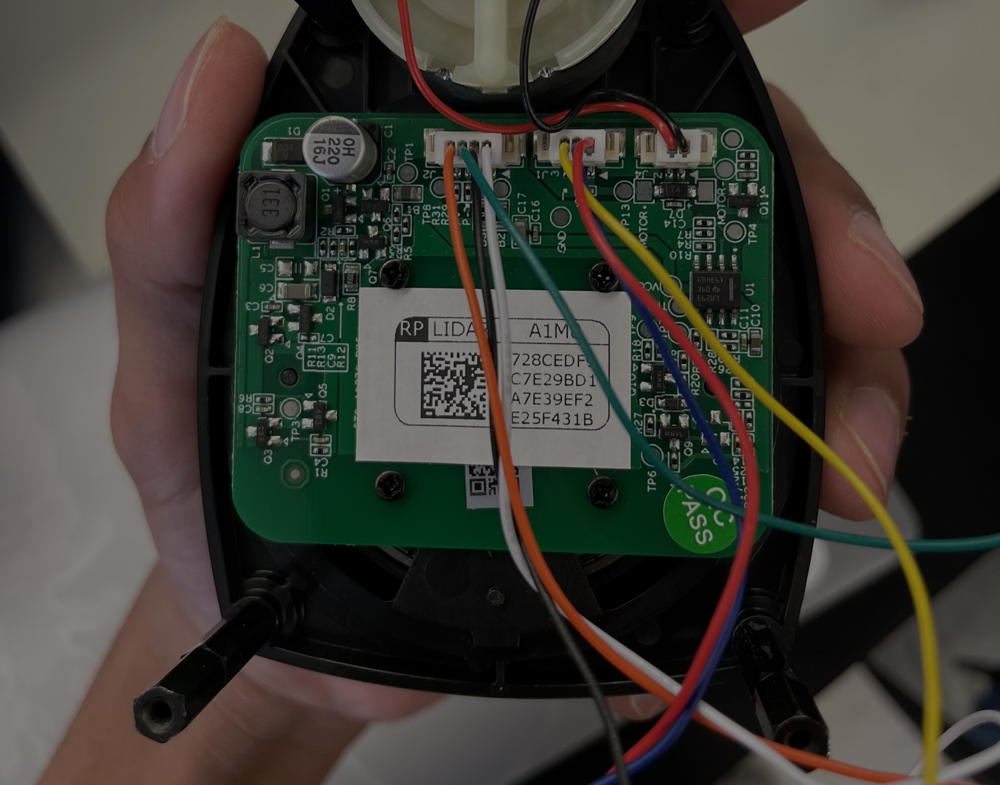

### Hi I'm Raghav

<!--
**MythicalCow/MythicalCow** is a ✨ _special_ ✨ repository because its `README.md` (this file) appears on your GitHub profile.

Here are some ideas to get you started:

- 🔭 I’m currently working on ...
- 🌱 I’m currently learning ...
- 👯 I’m looking to collaborate on ...
- 🤔 I’m looking for help with ...
- 💬 Ask me about ...
- 📫 How to reach me: ...
- 😄 Pronouns: ...
- ⚡ Fun fact: ...
-->

I'm a student pursuing computer engineering at the University of Illinois at Urbana-Champaign. My primary interests are computer vision, embedded systems programming, and electronics.

### My Website

You can take a look at my resume, projects, and guides [here](https://raghavtirumale.github.io/)

